## echart-ssr：在服务端渲染 ECharts 并输出图片

本项目演示如何在 Node.js 环境下使用 ECharts 的 SSR（Server-Side Rendering）能力生成 SVG 与 PNG 图片。你既可以在命令行直接调用，也可以在代码中以函数方式调用。

### 环境要求
- Node.js 16+（Windows/macOS/Linux 均可）
- 已安装依赖：`echarts`、`sharp`

### 安装
```bash
npm i
```

### 命令行用法（CLI）
支持通过 JSON 文件或内联 JSON 传入 ECharts option。

- 从文件读取（推荐）：
```bash
node main.js --optionPath=./option.json --width=800 --height=600 --outDir=./output --outName=mychart --format=both
```

- 内联 JSON（PowerShell 示例）：
```bash
node main.js --option='{"xAxis":{"type":"category","data":["Mon","Tue"]},"yAxis":{"type":"value"},"series":[{"type":"bar","data":[120,200]}]}' --width=800 --height=600 --format=png
```

- 内联 JSON（Windows CMD 示例）：
```bash
node main.js --option="{\"xAxis\":{\"type\":\"category\",\"data\":[\"Mon\",\"Tue\"]},\"yAxis\":{\"type\":\"value\"},\"series\":[{\"type\":\"bar\",\"data\":[120,200]}]}" --format=svg
```

参数说明：
- `--optionPath` 或 `--option`：二选一，ECharts option 来源
- `--width`、`--height`：画布尺寸，默认 `400x300`
- `--outDir`：输出目录，默认 `./output`
- `--outName`：输出文件名（不含后缀），默认 `chart`
- `--format`：`svg` | `png` | `both`，默认 `both`

注意：`--format` 用法是 `--format=png` 或 `--format png`，不要写成 `--format==png`。

### 代码内用法（API）
```js
const { renderEChartToFiles, renderEChartToBuffers, renderOptionToSVG } = require('./main');

// 写文件
await renderEChartToFiles({
  option,                 // ECharts 配置对象
  width: 800,
  height: 600,
  formats: ['svg', 'png'],
  outDir: './output',
  outName: 'mychart'
});

// 获取内存 Buffer（无需落盘）
const { svg, png } = await renderEChartToBuffers({
  option,
  width: 800,
  height: 600,
  formats: ['png']
});

// 仅获取 SVG 字符串
const svgStr = renderOptionToSVG(option, 800, 600);
```

### 示例参数文件：`option.json`
项目已内置一个最小示例（柱状图）：

```json
{
  "xAxis": { "type": "category", "data": ["Mon", "Tue", "Wed", "Thu", "Fri", "Sat", "Sun"] },
  "yAxis": { "type": "value" },
  "series": [{ "type": "bar", "data": [120, 200, 150, 80, 70, 110, 130] }]
}
```

### 示例输出图片（来自 `./output`）
- PNG 示例：
- SVG 示例：

> 若首次运行还未生成输出，请执行命令：
> ```bash
> node main.js --optionPath=./option.json --format=both
> ```

### SVG 转 PNG 的实现
渲染流程：ECharts 在 SSR 下输出 SVG 字符串，随后使用 `sharp` 将该 SVG 栅格化并编码为 PNG。
关键代码：
```js
const svgStr = renderOptionToSVG(option, width, height);
await sharp(Buffer.from(svgStr)).png({ quality: 90 }).toFile(pngPath);
```

### 常见问题
- 进程不退出：已在 CLI 中渲染完成后 `process.exit(0)`，并对图表实例调用了 `dispose()`；如果你在自定义调用时悬挂，确认未保留未关闭的句柄（计时器/文件流等）。
- `--format` 写成 `--format==png` 会被解析为 `=png`，导致不生效；请使用 `--format=png` 或 `--format png`。
- PNG 模糊：可以通过 `sharp(Buffer.from(svgStr), { density: 144 })` 提升清晰度（同时增大体积）。

### 许可证
MIT


